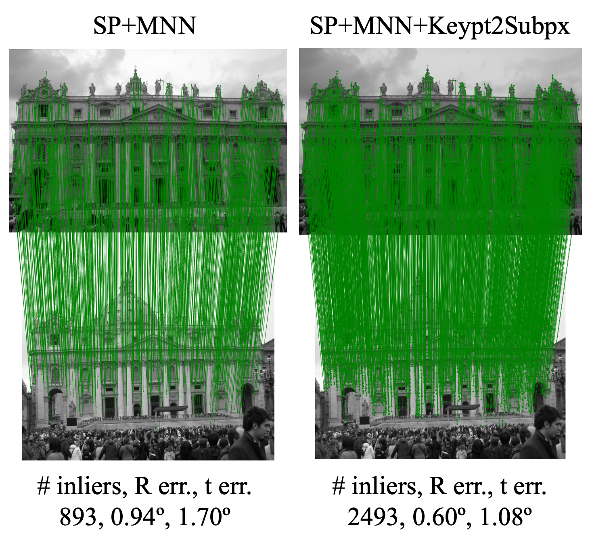

<p align="center">
  <h1 align="center"> Learning to Make Keypoints Sub-Pixel Accurate<br> ECCV 2024</h1>
  <p align="center">
    <a href="https://scholar.google.com/citations?user=V8mY8rUAAAAJ">Shinjeong Kim</a>
    ·
    <a href="https://scholar.google.com/citations?user=YYH0BjEAAAAJ">Marc Pollefeys</a>
    ·
    <a href="https://scholar.google.com/citations?user=U9-D8DYAAAAJ">Dániel Béla Baráth</a>
  </p>
  <h2 align="center"><p>
    <a href="https://arxiv.org/abs/2407.11668" align="center">Arxiv</a> | 
    <a href="TODO" align="center">ECCV (TODO)</a> | 
    <a href="TODO" align="center">Project Page (TODO)</a>
  </p></h2>
  <div align="center"></div>
</p>
<p align="center">
    <!-- 
    <br> -->
    
    <br>
    <em>The Keypt2Subpx module learns multi-view consistent sub-pixel adjustment for <b>any</b> keypoints, given the prospective keypoint correspondence between two images.</em>
</p>

## What Does Keypt2Subpx Do?
<!--  -->
<p align="center">
    <!-- 
    <br> -->
    
</p>

The Keypt2Subpx module act as an add-on on top of any classic detect-and-match approaches that find two-view sparse correspondence. By performing sub-pixel adjustment to the keypoints, the proposed lightweight module makes not only keypoints but also two-view end tasks (e.g. relative pose estimation, fundamental matrix estimation, etc.) more accurate, adding only insignificant amount of inference time.

## How to Use Keypt2Subpx?
<!-- TODO: Add Demo -->
<!-- [demos](demo) -->
Inference of Keypt2Subpx module does not require any extra depedencies except PyTorch. The placeholders (`keypt`, `img`, `desc`, and `score`) in the code snippet given below can be replaced with your own data.
```python
import torch

# 1. Load pretrained model (default model is for SuperPoint + LightGlue)
keypt2subpx = torch.hub.load('KimSinjeong/keypt2subpx', 'Keypt2Subpx', pretrained=True, detector='splg')

# 2. Prepare below form of data (Your job)
H, W, N = 768, 1024, 2048 # Note: two images need not to have the same size
# N initial keypoint matches in pixel coordinate
keypt1 = torch.cat([torch.randint(0, W, (N, 1)), torch.randint(0, H, (N, 1))], axis=-1)
keypt2 = torch.cat([torch.randint(0, W, (N, 1)), torch.randint(0, H, (N, 1))], axis=-1)
# color (3, H, W) or greyscale (1, H, W) images in (0, 1) range
img1, img2 = torch.rand(3, H, W), torch.rand(3, H, W)
# descriptors
desc1, desc2 = torch.randn(N, 256), torch.randn(N, 256)
# dense score map (1, H, W), needed for only SuperPoint and Aliked
score1, score2 = torch.rand_like(img1[0:1,...]), torch.rand_like(img2[0:1,...]) 

# 3. Inference!
refined_keypt1, refined_keypt2 = keypt2subpx(keypt1, keypt2, img1, img2, desc1, desc2, score1, score2)
```

## Preparation
### Environment
Although Keypt2Subpx module only relies on PyTorch dependency, keypoint detector, description and matching involved for training and evaluation requires extra dependencies. One can follow below procedure to install the necessary packages at a conda environment. First, clone this repository and create a conda environment.
```bash
git clone --recurse-submodules https://github.com/KimSinjeong/keypt2subpx.git
cd keypt2subpx

conda create -n keypt2subpx python=3.11
conda activate keypt2subpx
```

Then install PyTorch and other dependencies.
```bash
# Install PyTorch
pip install torch==2.1.2 torchvision==0.16.2 torchaudio==2.1.2 --index-url https://download.pytorch.org/whl/cpu
# or below to use GPU
# pip install torch==2.1.2 torchvision==0.16.2 torchaudio==2.1.2 --index-url https://download.pytorch.org/whl/cu121

# Install Glue Factory (https://github.com/cvg/glue-factory)
cd submodules/glue_factory
python -m pip install -e .
cd ../../

# Install pygcransac
pip install pygcransac
```

### Keypoint Extraction & Matching
<!-- TODO: Add training -->
<!-- [experiments](experiments) [data_prep](data_prep). -->
First, extract and match keypoints and keep the matched keypoints and patches around them as below:
```bash
# --variant (-v) train: Train set, val: Validation set, test: Test set
python dataprocess/splg.py -v train
python dataprocess/splg.py -v val # MegaDepth-1500 benchmark
python dataprocess/splg.py -v test
```
**Note**: This will automatically download the MegaDepth dataset through the [Glue Factory](https://github.com/cvg/glue-factory) library, which will take about 450GB of storage. Keypoint extraction and matching on test set (the last line) will take extra 1~2TB (depending on which detector / descriptor / matcher you use).

## Usage
### Training
After keypoint extraction and matching (for train and validation split), Keypt2Subpx model can be trained as below:
```bash
python train.py splg_train -detc splg
```
The `--detector` or `-detc` option is to choose which detector and matcher combination we will use. We currently support SuperPoint+LightGlue (`splg`), ALIKED+LightGlue (`aliked`), DeDoDe+DSM (`dedode`), and XFeat+MNN (`xfeat`). The SuperPoint+MNN combination is based on implementation of [Reinforced Feature Point](https://arxiv.org/abs/1912.00623), different from `splg` and `aliked` which are based on [Glue Factory](https://github.com/cvg/glue-factory), and thus this needs extra work to be seamlessly merged into this repository and will be added soon. You may simply use `spnn` option if you want, but it will not accurately reproduce the paper's results because of the aforementioned reason.

### Evaluation
To evaluate the pretrained model on the validation set, run below:
```bash
python test.py splg_val -m pretrained/k2s_splg_pretrained.pth # Validation set
```

To evaluate the pretrained model on the test set, run below:
```bash
python test.py splg_test --test -m pretrained/k2s_splg_pretrained.pth # Test set
```

If you want to compare the results of Keypt2Subpx module against when without it, add `--vanilla` option:
```bash
python test.py splg_vanilla_test --vanilla # Validation set
python test.py splg_vanilla_test --test --vanilla # Test set
```

Since test set is large, we support an option to evaluate a part of it. `--total_split` or `-ts` is the number of total split and `--current_split` or `-cs` is the index of current split. Below is an example of evaluating one third of the test set three times. When with multiple machines, one could distribute each split to each machine.
```bash
python test.py splg_test --test -m pretrained/k2s_splg_pretrained.pth -ts 3 -cs 1 # Part 1 / 3
python test.py splg_test --test -m pretrained/k2s_splg_pretrained.pth -ts 3 -cs 2 # Part 2 / 3
python test.py splg_test --test -m pretrained/k2s_splg_pretrained.pth -ts 3 -cs 3 # Part 3 / 3
```

After partial evaluation, a pickle file containing the evaluation result for each part is generated, which can be summarized for all parts as below:
```bash
python summarize.py splg_test
```
`splg_test` can be replaced with the experiment name used for test set evaluation.

<!-- ## Pretrained Models -->
<!-- TODO: Add Pretrained Models as releases (SPNN, SPLG, ALIKED, DeDoDe) -->

## Coming Soon
- [x] Train code
- [x] Test code
- [x] Code overall refinement
- [x] Pretrained Models
- [x] Dataloader code refinement (array shape and loader code itself)
- [x] Data Processing code: SP (NN/LG) and ALIKED
- [x] Data Processing code: DeDoDe and XFeat
- [x] Demo code
- [x] README & LICENSE
- [ ] Demo: support batch prediction and add a sample pair
- [ ] Paper link
- [ ] SP+MNN based on Reinforced Feature Point implementation

## Citation
Please cite the paper below, if you find this work useful:
```bibtex
@InProceedings{kim2024keypt2subpx,
    author = {Shinjeong Kim and Marc Pollefeys and Daniel Barath},
    title = {Learning to Make Keypoints Sub-Pixel Accurate},
    booktitle = {The European Conference on Computer Vision (ECCV)},
    year = {2024}
}
```

## License
<!-- All code/models are Apache-2 license -->
[](LICENSE)

## Acknowledgement
This work is conducted as a part of the *Research in Computer Science* course at ETH Zurich, utilizing the computational resources of the [ETH Computer Vision and Geometry (CVG) Group](https://cvg.ethz.ch/). The authors would like to thank Tong Wei, Alan Paul, and Fengshi Zheng for their helpful discussions. This work was partially funded by the ETH RobotX research grant, and the Hasler Stiftung Research Grant via the ETH Zurich Foundation. The format of this README documents is borrowed from that of [DeDoDe](https://github.com/Parskatt/DeDoDe).
